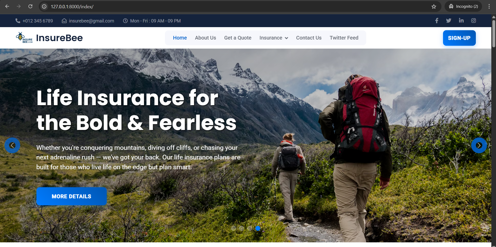
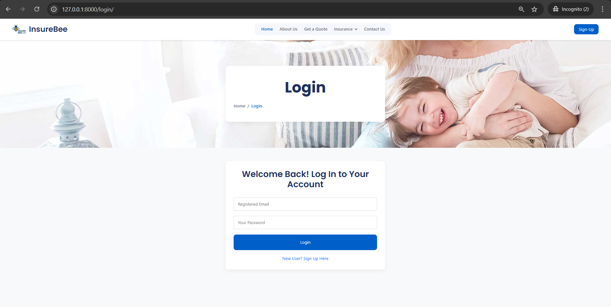
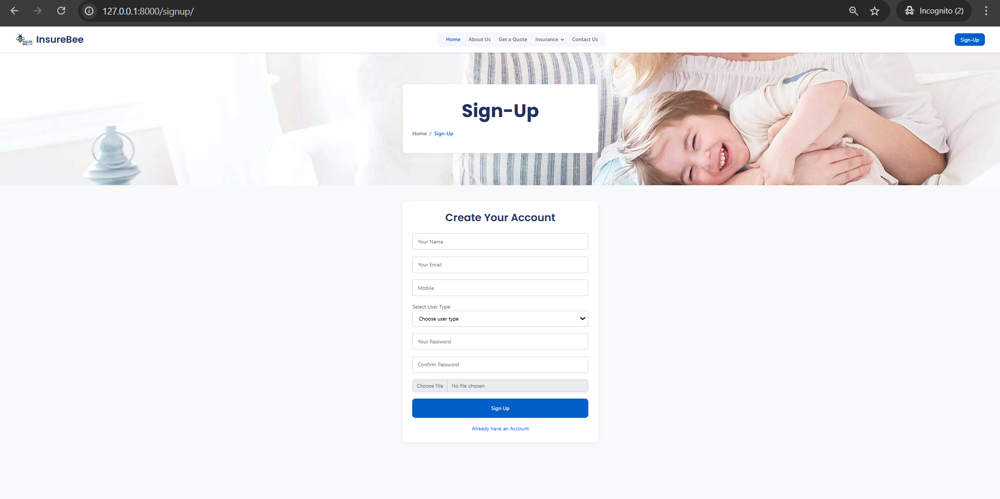
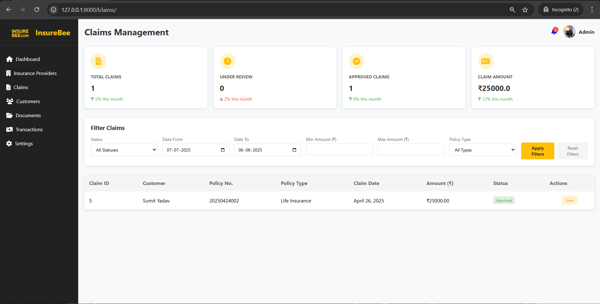
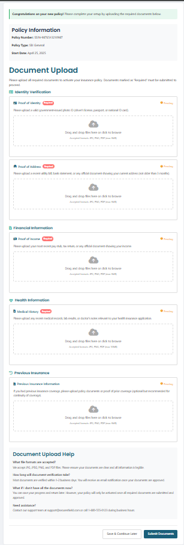

# 🐝 InsureBee - Life Insurance for the Bold & Fearless

<p align="center">
  
</p>

<p align="center">
  <em>A comprehensive insurance management platform designed for adventurous individuals who live life on the edge but plan smart.</em>
</p>

<p align="center">
  
  
  
</p>

## 📸 Screenshots

### Landing Page

*Modern hero section with adventure-themed imagery and clear call-to-action*

### User Authentication
<div align="center">
  
  
</div>
*Secure login and registration system with user type selection*

### Admin Dashboard

*Comprehensive analytics and statistics overview*

### Insurance Partners

*Integration with 6+ major insurance providers*

### Document Upload

*User-friendly drag-and-drop document management system*

### Quote Generation

*Dynamic pricing calculations with comprehensive coverage details*

## 🌟 Features

### 🏠 Landing Page
- **Stunning Hero Section**: Adventure-themed imagery with compelling messaging
- **Clear Value Proposition**: Targeted at extreme sports enthusiasts and adventurers
- **Responsive Design**: Modern UI/UX that works across all devices
- **Call-to-Action**: Easy navigation to key platform features

### 🔐 Authentication System
- **Secure Login**: Email/password authentication
- **User Registration**: Complete sign-up process with user type selection
- **Profile Management**: Comprehensive user account management

### 📊 Dashboard Analytics
Real-time statistics and monitoring:
- **Total Policies**: 6 (↗ 12% growth)
- **Active Customers**: 1 (↗ 6% growth)
- **Premium Collected**: ₹132,000 (↗ 15% growth)
- **Insurance Partners**: 6 (↗ 2 new this month)

### 🤝 Insurance Partners
Support for multiple insurance providers:
- **HDFC ERGO** - Life Insurance (30 years, ₹25,000 premium)
- **TATA AIG** - Life Insurance (25 years, ₹30,000 premium)
- **ICICI Lombard** - Home Insurance (1 year, ₹5,000 premium)
- **StarHealth** - Health Insurance (1 year, ₹12,000 premium)
- **SBI General** - Auto Insurance (1 year, ₹15,000 premium)
- **Bajaj Allianz** - Business Insurance (1 year, ₹45,000 premium)

### 📁 Document Management
Comprehensive document upload system:
- ✅ **Identity Verification** (Required)
- ✅ **Proof of Address** (Required)
- ✅ **Financial Information** (Required)
- ✅ **Health Information** (Required)
- ⚪ **Previous Insurance** (Optional)

### 💰 Quote System
- **Dynamic Quote Generation**: Real-time pricing calculations
- **Comprehensive Coverage**: Detailed policy information including:
  - Policy duration and coverage amount
  - Inpatient hospitalization coverage
  - Life cover benefits
  - Accidental death benefits
  - Daycare procedures (60+ covered)
  - Maturity benefits
  - Tax benefits under Section 80C and 10(10D)
  - Critical illness cover (Premium feature)

## 🛠️ Tech Stack

- **Frontend**: HTML5, CSS3, JavaScript
- **Backend**: [Your backend technology]
- **Database**: [Your database choice]
- **Authentication**: Secure login/registration system
- **File Upload**: Document management system
- **Design**: Mobile-first responsive approach

## 📁 Project Structure

```
Insurebee/
├── screenshots/              # Project screenshots (PNG format)
│   ├── logo.png
│   ├── landing-page.png
│   ├── login-page.png
│   ├── signup-page.png
│   ├── dashboard.png
│   ├── insurance-partners.png
│   ├── document-upload.png
│   └── quote-generation.png
├── frontend/
│   ├── index.html           # Landing page
│   ├── login.html           # Login page
│   ├── signup.html          # Registration page
│   └── dashboard.html       # Admin dashboard
├── backend/
│   ├── models/              # Database models
│   ├── views/               # Application views
│   └── controllers/         # Business logic
├── assets/
│   ├── css/                 # Stylesheets
│   ├── js/                  # JavaScript files
│   └── images/              # Images and icons
└── docs/                    # Documentation
```

## 🚀 Getting Started

### Prerequisites
- [List your prerequisites here]

### Installation

1. **Clone the repository**
   ```bash
   git clone https://github.com/SumitBiniYadav/Insurebee.git
   cd Insurebee
   ```

2. **Install dependencies**
   ```bash
   # Add your installation commands here
   npm install
   ```

3. **Configure environment**
   ```bash
   # Copy environment template
   cp .env.example .env
   # Update with your configuration
   ```

4. **Run the application**
   ```bash
   # Add your start commands
   npm start
   ```

5. **Access the application**
   - **Local development**: http://127.0.0.1:8000
   - **Login page**: http://127.0.0.1:8000/login/
   - **Registration**: http://127.0.0.1:8000/signup/

## 🎯 Core Functionalities

### Real-time Analytics
- Policy tracking and monitoring
- Customer growth analytics
- Premium collection insights
- Partner network expansion metrics

### Multi-Provider Integration
- Support for 6+ major insurance providers
- Diverse policy types (Life, Health, Auto, Home, Business)
- Flexible coverage options and durations

### Document Management
- Secure file upload functionality
- Multiple document categories
- Validation and verification process
- User-friendly drag-and-drop interface

### Quote Generation
- Dynamic pricing calculations
- Comprehensive coverage details
- Instant quote generation
- Multiple payment options

## 🤝 Contributing

We welcome contributions! Please follow these steps:

1. Fork the repository
2. Create your feature branch (`git checkout -b feature/AmazingFeature`)
3. Commit your changes (`git commit -m 'Add some AmazingFeature'`)
4. Push to the branch (`git push origin feature/AmazingFeature`)
5. Open a Pull Request

## 📞 Contact & Support

**Business Hours**: Mon-Fri: 09 AM - 09 PM

- 📧 **Email**: [insurebee@gmail.com](mailto:insurebee@gmail.com)
- 📞 **Phone**: +012.345.6789
- 🆘 **Customer Support**: 1-800-555-1234 (Monday-Friday: 8am-8pm, Saturday: 9am-5pm)
- 🌐 **Website**: [InsureBee Platform](http://127.0.0.1:8000)

## 👨‍💻 Author

**Sumit Bini Yadav**
- GitHub: [@SumitBiniYadav](https://github.com/SumitBiniYadav)

## 📄 License

This project is licensed under the MIT License - see the [LICENSE.md](LICENSE.md) file for details.

## 📝 Changelog

### v1.0.0 - Initial Release
- ✅ Dashboard analytics
- ✅ Multi-provider integration
- ✅ Document management system
- ✅ Quote generation
- ✅ User authentication system
- ✅ Responsive web design

## 🎯 Future Roadmap

- [ ] Mobile app development
- [ ] AI-powered risk assessment
- [ ] Real-time chat support
- [ ] Payment gateway integration
- [ ] Advanced analytics dashboard
- [ ] Multi-language support

---

<p align="center">
  <em>Built with ❤️ for adventure enthusiasts who believe in planning smart while living boldly.</em>
</p>

<p align="center">
  <strong>Whether you're conquering mountains, diving off cliffs, or chasing your next adrenaline rush – we've got your back!</strong>
</p>
